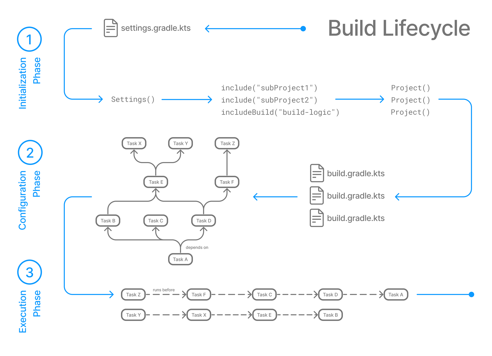

## Gradle
- Gradle은 빌드 스크립트를 기반으로 _**소프트웨어 프로젝트의 빌드, 테스트, 배포 과정을 자동화**_ 해주는 도구다.


## Gradle Build Lifecycle
- 빌드 라이프사이클은 요청된 ***Task를 실행하기 위해서 Gradle이 거치는 일련의 단계***며, 빌드 환경 초기화부터 프로젝트 구성 및 Task 실행까지의 과정을 포함한다.

### Build Lifecycle Phases


#### 1. Initialization Phase (초기화)
- 셋팅 파일을 확인한 이후, 프로젝트 구조를 분석하고 어떤 프로젝트가 빌드에 포함될지 결정한다.
    - `settings.gradle.kts` 파일을 읽고, Settings 객체 생성
    - 해당 객체를 통해서 프로젝트 구조 파악 이후, Project 객체 생성

#### 2. Configuration Phase (구성)
- 빌드 파일을 확인한 이후, 요청된 Task에 대하여 Task Graph 생성한다.
  - 모든 `build.gradle.kts` 파일을 읽고, 해당 파일에 정의된 Task, 플러그인, 의존성등을 파악
  - 이후 요청된 Task를 실행하기 위해서 필요한 Task들을 파악하여 Task Graph 구성

#### 3. Execution Phase (실행)
- Task Graph에 따라 실제 Task 실행한다.
  - 컴파일 및 테스트, 패키징등과 같은 작업 수행

### Gradle Build Lifecycle 예시

- 아래는 `./gradlew :lifecycle:hello` 명령어를 실행했을 때, 실제로 Gradle Build Lifecycle이 어떻게 진행되는지 보여주는 예시이다.

```kotlin
// ./settings.gradle.kts
rootProject.name = "kotlin"

include("lifecycle")

println("[Initialization Phase] 프로젝트 구조 파악")
```

```kotlin
// ./build.gradle.kts
println("[Configuration Phase] build.gradle.kts 스크립트 읽기 시작")

plugins {
    kotlin("jvm") version "2.2.21"
}

dependencies {
  testImplementation(kotlin("test"))
}

tasks.withType<Test> {
    useJUnitPlatform()
}

println("[Configuration Phase] build.gradle.kts 스크립트 읽기 완료")
```

```kotlin
// ./lifecycle/build.gradle.kts

tasks.register("hello") {
    println("[Configuration Phase] hello task 등록")
    doFirst {
        println("[Execution Phase] hello task 실행 doFirst 블록")
    }
    doLast {
        println("[Execution Phase] hello task 실행 doLast 블록")
    }
}
```

```shell
## hello task 실행
./gradlew :lifecycle:hello

## 출력 결과
[Initialization Phase] 프로젝트 구조 파악

> Configure project :
[Configuration Phase] build.gradle.kts 스크립트 읽기 시작
[Configuration Phase] build.gradle.kts 스크립트 읽기 완료
[Configuration Phase] hello task 등록

> Task :lifecycle:hello
[Execution Phase] hello task 실행 doFirst 블록
[Execution Phase] hello task 실행 doLast 블록

```

> https://docs.gradle.org/current/userguide/build_lifecycle_intermediate.html


## Gradle Build Environment
> https://docs.gradle.org/current/userguide/build_environment.html


## Dependency Management
- Gradle에서 의존성(Dependency)은 프로젝트가 빌드되고 실행되기 위해 필요한 외부 라이브러리, 프레임워크, 모듈 등을 의미한다.
- Gradle은 의존성 관리(Dependency Management)를 통해서 ***프로젝트에 필요한 라이브러리를 자동으로 다운로드하고, 빌드 과정에서 해당 라이브러리를 포함***시켜준다.

### Dependency Configuration
- 의존성을 선언함과 동시에, 해당 의존성이 언제 어떻게 사용될지를 결정
  - 예를 들어 compileOnly의 경우에는 컴파일 시점에만 해당 라이브러리를 참조하여 사용하고 런타임 시점에는 라이브러리가 포함되지 않는다.
    - Lombok 라이브러리가 대표적인 예시
  - 반대로 runtimeOnly의 경우에는 컴파일 서점에는 해당 라이브러리를 참조하지 않지만, 런타임 시점에는 라이브러리가 포함된다.
    - mysql-connector 라이브러리가 대표적인 예시

#### api vs implementation

- api와 implementation의 차이점은 의존성 노출(Dependency Exposure) 여부에 따라 나뉜다.
  - api: 내가 만든 모듈을 의존하는 다른 모듈에서도 해당 라이브러리를 사용할 수 있도록 노출
  - implementation: 내가 만든 모듈 내부에서만 해당 라이브러리를 사용하도록 제한


> https://docs.gradle.org/current/userguide/dependency_management_basics.html
> https://docs.gradle.org/current/userguide/part3_gradle_dep_man.html


## Plugin

- Plugin은 ***빌드 프로세스를 확장하고 자동화***하여 특정 작업을 쉽게 수행할 수 있도록 도와준다. 프로젝트에 필요한 의존성을 주입받기 위해서 dependencies에 의존성을 정의하여 사용하는것과 비슷하게, Plugin은 빌드에 필요한 의존성을 추가하여 사용할 수 있다. 
  - 코드 컴파일, 테스트 실행, 패키징, 배포 등 다양한 작업을 수행할 수 있도록 한다.
- Plugin 덕분에 개발자는 빌드 작업에 필요한 코드를 직접 작성할 필요 없이 쉽게 빌드 프로세스를 구성할 수 있다.
  - Gradle에서 `java` 플러그인을 적용하여 컴파일, 테스트, Jar 생성 등의 작업을 자동화할 수 있다.
- 이러한 Plugin 속성 덕분에 외부에서 만들어진 Plugin을 쉽게 적용하던가, 직접 Plugin을 만들어서 배포하여 사내에서 활용이 가능하다.
  - Core Plugin: Gradle에 기본적으로 포함되어 있는 플러그인 (Java)
  - Community Plugins: Gradle Plugin Portal이나 기타 저장소에서 제공되는 플러그인
  - Local or Custom Plugins: 개발자가 직접 작성한 플러그인

> https://docs.gradle.org/current/userguide/plugin_basics.html
> https://docs.gradle.org/current/userguide/plugins.html